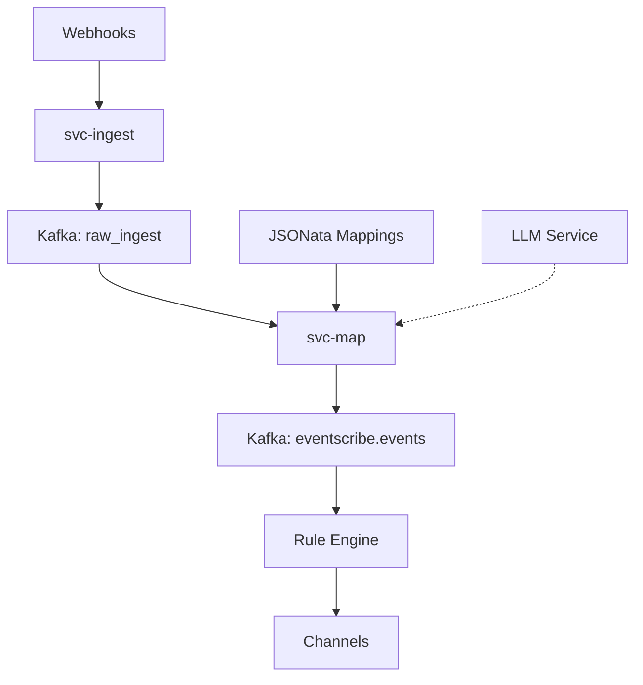

# EventScribe

> **Make any event from anywhere instantly understandable and actionable by anyone.**

EventScribe transforms chaotic webhook payloads into standardized CloudEvents with a canonical format that both humans and machines can understand. Create smart event routing with natural language - no JSON wrangling required.

## 🚀 Quick Start

### Prerequisites

- Python 3.12+
- Docker & Docker Compose
- Git

### Installation

1. **Clone the repository:**
   ```bash
   git clone https://github.com/convolabai/eventscribe.git
   cd eventscribe
   ```

2. **Start the stack:**
   ```bash
   docker-compose up -d
   ```

3. **Install EventScribe:**
   ```bash
   pip install -e .
   ```

4. **Run the services:**
   ```bash
   eventscribe
   ```

The API server will be available at `http://localhost:8000` with:
- Webhook ingestion at `/ingest/{source}`
- Interactive demo at `/demo`
- API docs at `/docs`

## 🎯 Core Features

### Universal Webhook Ingestion
- **Single endpoint** accepts webhooks from any source (GitHub, Stripe, Slack, etc.)
- **HMAC signature verification** ensures payload authenticity
- **Rate limiting** protects against abuse
- **Dead letter queue** for error handling

### Intelligent Event Transformation
- **JSONata mapping engine** converts raw payloads to canonical format
- **LLM-powered fallback** generates mappings for unknown events
- **CloudEvents 1.0 compliance** for interoperability
- **Schema validation** ensures data quality

### Natural Language Subscriptions
- **Plain English queries** like "Notify me when PR 1374 is approved"
- **LLM-generated CESQL filters** automatically translate intent to code
- **Multiple delivery channels** (Slack, email, webhooks)

## 📊 Canonical Event Format

EventScribe transforms any webhook into a standardized five-tuple format:

```json
{
  "publisher": "github",
  "resource": {
    "type": "pull_request",
    "id": 1374
  },
  "action": "update",
  "timestamp": "2025-06-03T15:45:02Z",
  "summary": "PR 1374 approved by Alice",
  "raw": { /* original webhook payload */ }
}
```

This consistent structure enables powerful filtering and routing capabilities across all event sources.

## 🛠 Usage Examples

### 1. Ingest a GitHub Webhook

```bash
curl -X POST http://localhost:8000/ingest/github \
  -H "Content-Type: application/json" \
  -H "X-GitHub-Event: pull_request" \
  -d '{
    "action": "opened",
    "pull_request": {
      "number": 1374,
      "title": "Add new feature"
    }
  }'
```

### 2. Generate a Mapping Suggestion

```bash
curl -X POST http://localhost:8000/map/suggest-map \
  -H "Content-Type: application/json" \
  -d '{
    "source": "github",
    "payload": {
      "action": "opened",
      "pull_request": {"number": 1374}
    }
  }'
```

### 3. Monitor System Metrics

```bash
# Prometheus metrics
curl http://localhost:8000/map/metrics

# JSON metrics
curl http://localhost:8000/map/metrics/json
```

## 🎭 Interactive Demo

Visit `http://localhost:8000/demo` to:
- Send sample webhooks from popular services
- See real-time event transformation
- Test natural language subscriptions
- Explore the canonical event format

## ⚙ Configuration

EventScribe is configured via environment variables:

### Core Settings
```bash
# Kafka Configuration
KAFKA_BOOTSTRAP_SERVERS=localhost:9092
KAFKA_TOPIC_RAW=raw_ingest
KAFKA_TOPIC_CANONICAL=eventscribe.events
KAFKA_TOPIC_DLQ=eventscribe.dlq

# Service Settings
LOG_LEVEL=info
DEBUG=false
MAX_BODY_BYTES=10485760  # 10MB
```

### Security (Optional)
```bash
# HMAC signature verification
GITHUB_WEBHOOK_SECRET=your-github-secret
STRIPE_WEBHOOK_SECRET=whsec_your-stripe-secret

# LLM integration for mapping suggestions
OPENAI_API_KEY=sk-your-openai-key
```

### Advanced Configuration
```bash
# Mapping files location
MAPPINGS_DIR=/app/mappings

# Rate limiting
RATE_LIMIT_REQUESTS=1000
RATE_LIMIT_WINDOW=60

# Redis for rate limiting
REDIS_URL=redis://localhost:6379
```

## 📈 Performance

EventScribe is designed for high throughput:

- **≥ 2,000 events/second** (single 2-core container)
- **≤ 40ms p95 latency** for event transformation
- **< 1% mapping failure rate**
- **≤ 5% LLM fallback usage**

## 🏗 Architecture



### Services

1. **svc-ingest**: HTTP webhook receiver with signature verification
2. **svc-map**: Event transformation engine with LLM fallback
3. **Rule Engine**: Natural language subscription matching (coming soon)

## 🧪 Testing

Run the test suite:

```bash
# Unit tests
pytest tests/

# Integration tests with Docker Compose
docker-compose -f docker-compose.test.yml up --abort-on-container-exit

# Load testing
python scripts/load_test.py
```

## 📚 Documentation

- [Agent Documentation](./AGENTS.md) - For AI agents and contributors
- [API Reference](http://localhost:8000/docs) - Interactive OpenAPI docs
- [Examples](./examples/) - Sample payloads and mappings
- [Schemas](./schemas/) - JSON schemas for validation

## 🤝 Contributing

We welcome contributions! Please see our [Contributing Guide](./CONTRIBUTING.md) for details.

### Development Setup

```bash
# Install development dependencies
pip install -e ".[dev]"

# Run linting
ruff check opensense/
ruff format opensense/

# Run type checking
mypy opensense/
```

## 📄 License

EventScribe is licensed under the [MIT License](./LICENSE).

## 🌟 Why EventScribe?

| Traditional Integration | EventScribe |
|------------------------|-----------|
| Write custom parsers for each webhook | Single canonical format |
| Maintain brittle glue code | JSONata mappings + LLM fallback |
| Technical expertise required | Natural language subscriptions |
| Vendor lock-in with iPaaS | Open source, self-hostable |
| Complex debugging | End-to-end observability |

---

**Ready to simplify your event integrations?** Get started with the [Quick Start](#-quick-start) guide or try the [interactive demo](http://localhost:8000/demo).

For questions or support, visit our [GitHub Issues](https://github.com/convolabai/eventscribe/issues).